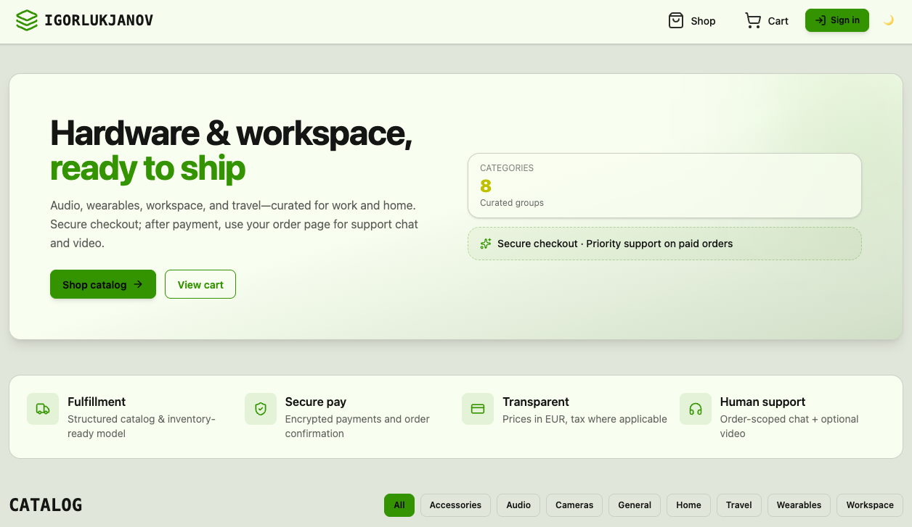

# E-Commerce Platform



A production-ready full-stack e-commerce platform with real-time order support chat, live video calls, payment processing, and an admin product management dashboard. Built as a TypeScript monorepo.

---

## Features

- **Storefront** — product catalog with category filtering, optimised ImageKit CDN images
- **Cart & Checkout** — client-side cart with Polar payment processing and webhook-driven order fulfilment
- **Order Management** — full order history for customers; staff see all orders across users
- **Real-time Support Chat** — per-order Stream Chat channel between customer and support
- **Live Video Calls** — staff can escalate any order chat to a Stream Video call
- **Admin Dashboard** — create, edit, and delete products with direct ImageKit image uploads
- **Role-based Access** — three roles (`customer`, `support`, `admin`) enforced on both frontend and backend via Clerk
- **Mobile-first UI** — responsive design with a bottom tab bar on mobile

---

## Stack

**Frontend** (`web/`)
- React 19 + Vite + TypeScript
- Tailwind CSS v4 + daisyUI (theming: light/dark)
- React Router v7
- TanStack Query (server state)
- Clerk — authentication, session management
- Stream Chat React — real-time order support chat
- Stream Video React SDK — live video calls
- ImageKit — image CDN and upload
- Sentry — frontend error monitoring
- Zod (via shared package)

**Backend** (`backend/`)
- Express 5 + TypeScript
- Neon (serverless PostgreSQL)
- Drizzle ORM
- Clerk — JWT verification and user webhooks
- Polar — hosted checkout, payment webhooks
- Stream (Chat + Video) — channel and call management
- ImageKit — signed upload auth
- Sentry — backend error monitoring + Clerk user context
- node-cron — scheduled cleanup jobs
- tsup — TypeScript build

**Shared** (`shared/`)
- Zod schemas (`productCreateSchema`, `productPatchSchema`, `cartSchema`)
- TypeScript types shared between frontend and backend (`Order`, `Product`, `User`, API response envelopes)

**Infrastructure**
- Docker — multi-stage build (Vite build → compiled backend → minimal runner image)
- Render — single-container deployment; Express serves the Vite SPA as static files
- npm workspaces — monorepo dependency management

---

## Project structure

```
/
├── backend/        Express API
├── web/            React + Vite SPA
├── shared/         Shared Zod schemas and TypeScript types
├── docs/           Architecture and flow documentation
├── Dockerfile      Multi-stage build (web → backend → runner)
└── package.json    npm workspaces root
```

---

## Getting started

```bash
# Install all workspaces from the repo root
npm install

# Start the backend (hot reload via tsx watch)
cd backend && npm run dev

# Start the frontend
cd web && npm run dev
```

Create `backend/.env` with the required variables (see [`.env` reference in the backend README](backend/)).

---

## Deployment

Deployed as a single Docker container. Express serves the compiled Vite build as static files and falls back to `index.html` for client-side routing. API routes are served under `/api`.

```bash
docker build --build-arg VITE_CLERK_PUBLISHABLE_KEY=pk_... -t ecommerce .
```

---

## Docs

- [User journey & order flow](docs/user-journey.md)
- [Express middleware & error handling](docs/express-middleware.md)
